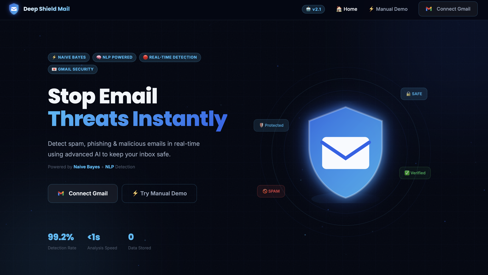
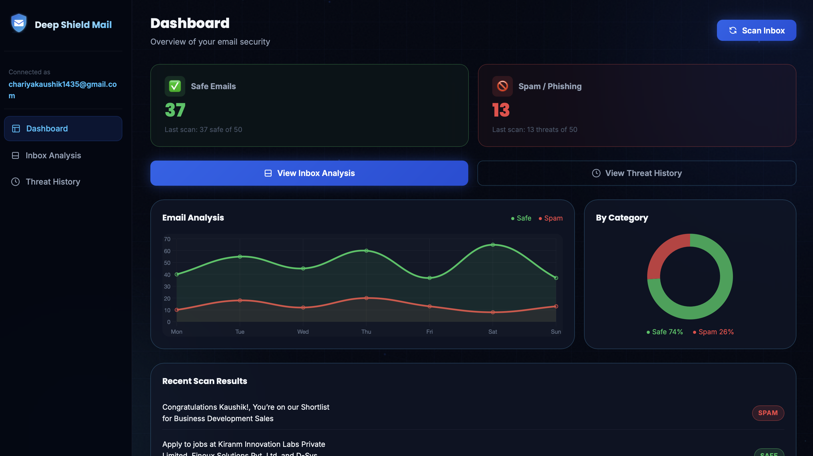
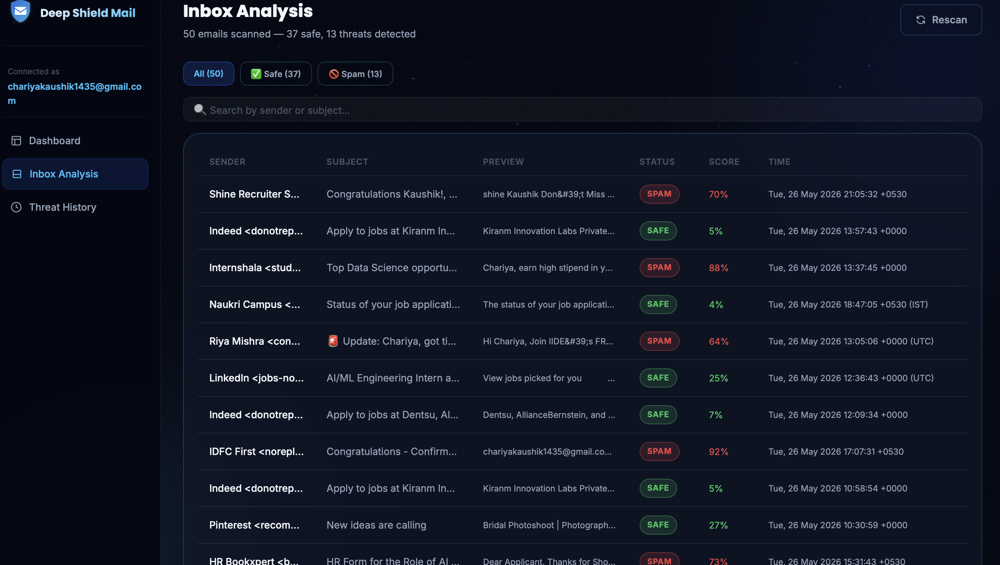
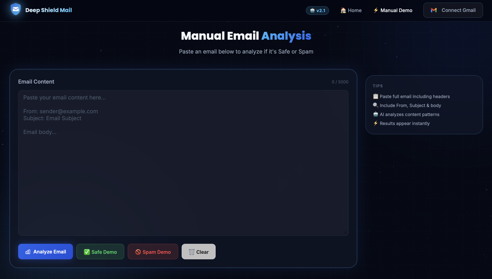
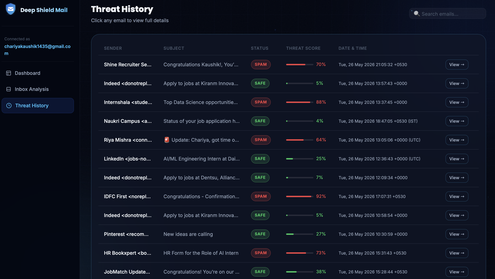

<div align="center">


<br/>

[](https://python.org)
[](https://flask.palletsprojects.com)
[](https://scikit-learn.org)
[](https://docker.com)
[](https://aws.amazon.com)
[](https://mlflow.org)
[](https://dvc.org)
[](https://nginx.org)

<br/>

> **Production-grade, end-to-end MLOps system that detects spam & phishing emails in real-time using Naive Bayes + NLP — deployed on AWS with full CI/CD.**

<br/>

[](https://deepshieldmail.duckdns.org)

</div>

---

## 📸 Demo

<div align="center">

### 🏠 Home — Stop Email Threats Instantly


<br/><br/>

### 📊 Dashboard — Real-time Threat Intelligence


<br/><br/>

### 📥 Inbox Analysis — Per-email Predictions & Confidence Scores


<br/><br/>

### ✍️ Manual Email Analysis — Paste & Analyze Instantly


<br/><br/>

### 🕵️ Threat History — Complete Scan Log with SAFE/SPAM Badges


</div>

---

## 📌 Table of Contents

| # | Section |
|---|---------|
| 1 | [💼 Business Problem](#-business-problem) |
| 2 | [✨ Features](#-features) |
| 3 | [🔬 ML Experiments](#-ml-experiments--algorithm-selection) |
| 4 | [🧠 Feature Engineering](#-feature-engineering) |
| 5 | [🔄 MLOps Pipeline](#-mlops-pipeline) |
| 6 | [🏗️ Architecture](#️-architecture) |
| 7 | [⚙️ CI/CD & Deployment](#️-cicd--deployment) |
| 8 | [🚀 Local Setup](#-local-setup) |
| 9 | [🐳 Docker](#-docker) |
| 10 | [🔌 API Endpoints](#-api-endpoints) |
| 11 | [🔐 Security & Privacy](#-security--privacy) |

---

## 💼 Business Problem

Email-based threats — spam, phishing, and malicious content — are among the most widespread cyberattacks globally. Users unknowingly interact with dangerous emails that lead to:

```
💸 Financial Fraud      →  Phishing emails stealing banking credentials
🪪 Identity Theft       →  Fake login pages harvesting personal data
🦠 Malware Infection    →  Malicious attachments and links
🔓 Privacy Breaches     →  Sensitive data exposed via social engineering
```

> Traditional spam filters fail against modern sophisticated attacks. Deep Shield Mail delivers **intelligent, real-time email threat detection** connected directly to your inbox — working instantly.

---

## ✨ Features

<table>
<tr>
<td width="50%">

🔐 **Gmail OAuth2 Integration**
Securely connect your Gmail inbox (read-only, no write permissions)

📊 **Real-time Dashboard**
Safe vs Spam stats, line chart, donut visualization — live data

📥 **Inbox Analysis**
Full inbox scan with per-email predictions & confidence scores

🕵️ **Threat History**
Complete scan history with SAFE/SPAM badges and timestamps

</td>
<td width="50%">

🤖 **AI-Powered Detection**
Naive Bayes + TF-IDF + 12 hand-crafted NLP features

✍️ **Manual Email Analysis**
Paste any raw email text for instant classification

📈 **MLflow Experiment Tracking**
All 6 algorithms tracked, compared, and versioned

🔒 **Zero Data Storage**
Emails never stored permanently — privacy first

</td>
</tr>
</table>

---

## 🔬 ML Experiments — Algorithm Selection

> All experiments tracked with **MLflow** across 6 algorithms on identical datasets.

| Algorithm | Accuracy | Precision | Recall | F1 Score | Status |
|-----------|:--------:|:---------:|:------:|:--------:|:------:|
| **Naive Bayes** | **97.8%** | **98.1%** | **97.4%** | **97.7%** | ✅ **Selected** |
| SVM (SVC) | 96.5% | 97.0% | 95.9% | 96.4% | — |
| Logistic Regression | 96.2% | 96.8% | 95.7% | 96.2% | — |
| Random Forest | 95.9% | 96.1% | 95.3% | 95.7% | — |
| XGBoost | 95.4% | 95.8% | 94.9% | 95.3% | — |
| Decision Tree | 93.1% | 93.4% | 92.6% | 93.0% | — |

> ✅ **Why Naive Bayes?** — Highest F1 score, fastest inference, best-suited for high-dimensional TF-IDF sparse text. Its probabilistic nature delivers natural confidence scores out-of-the-box.

### Experiment Notebooks

| Notebook | Algorithm | Role |
|----------|-----------|------|
| `exp-Naive_Bayes.ipynb` | Naive Bayes | ✅ Final Model |
| `exp-Logistic_Regression.ipynb` | Logistic Regression | Baseline |
| `exp-RandomForest.ipynb` | Random Forest | Ensemble |
| `exp-SVC.ipynb` | Support Vector Machine | Kernel-based |
| `exp-XGBoost.ipynb` | XGBoost | Gradient Boosting |
| `exp-DecisionTree.ipynb` | Decision Tree | Tree-based |

---

## 🧠 Feature Engineering

```
Raw Email Text
      │
      ├── 📧 EmailParser
      │         └── From · To · Subject · Date · Body
      │
      ├── 🔍 MetaFeatureExtractor   →  12 hand-crafted features
      │         ├── has_suspicious_links
      │         ├── sender_domain_match
      │         ├── exclamation_count
      │         ├── uppercase_ratio
      │         ├── has_html_tags
      │         ├── url_count
      │         └── ... (6 more)
      │
      └── 📝 BodyFeatureExtractor   →  TF-IDF (30,000 features)
                                                │
                                Final Matrix: (1, 30,012)
                                                │
                                    Naive Bayes Prediction
                                                │
                                    SAFE (0) / SPAM (1) + Probability Score
```

---

## 🔄 MLOps Pipeline

```
┌─────────────────────────────────────────────────────────────────────────────────┐
│                              TRAINING PIPELINE                                  │
├──────────────┬──────────────┬────────────────┬──────────────┬───────────────────┤
│ Data         │ Data         │ Data           │ Model        │ Model    Model    │
│ Ingestion    │ Validation   │ Transformation │ Training     │ Eval     Pusher   │
├──────────────┼──────────────┼────────────────┼──────────────┼───────────────────┤
│ CSV Load     │ Schema Check │ TF-IDF Fit     │ Naive Bayes  │ Metrics   S3/ECR  │
│ Train/Test   │ report.yaml  │ preprocessing  │ model.pkl    │ Compare   Push    │
│ Split        │              │ .pkl           │              │                   │
└──────────────┴──────────────┴────────────────┴──────────────┴───────────────────┘
```

### Pipeline Component Map

| Stage | File | Responsibility |
|-------|------|----------------|
| 📥 Data Ingestion | `data_ingestion.py` | Load raw CSV, train/test split |
| ✅ Data Validation | `data_validation.py` | Schema checks, drift detection |
| 🔀 Data Transformation | `data_transformation.py` | TF-IDF + hand-crafted features |
| 🤖 Model Trainer | `model_trainer.py` | Train Naive Bayes, save `model.pkl` |
| 📊 Model Evaluation | `model_evaluation.py` | Compare new model vs production |
| 🚀 Model Pusher | `model_pusher.py` | Push best model to S3 / ECR |

```bash
# Reproduce full pipeline
dvc repro

# Visualize pipeline DAG
dvc dag
```

---

## 🏗️ Architecture

```
                        User Browser
                              │
                              ▼
                  ┌─────────────────────┐
                  │  Nginx (SSL/TLS)     │
                  │  Let's Encrypt 443  │
                  │  deepshieldmail.    │
                  │  duckdns.org        │
                  └──────────┬──────────┘
                             │
                             ▼
                  ┌─────────────────────┐
                  │  Gunicorn           │
                  │  Flask App :8000    │
                  │  2 workers · 2 thr  │
                  └──────────┬──────────┘
                             │
              ┌──────────────┼──────────────┐
              ▼              ▼              ▼
        /auth/gmail     /api/emails     /api/scan
        Gmail OAuth2    Fetch Inbox     Prediction
        Google API      (limit=50)      Pipeline
                                            │
                              ┌─────────────┼─────────────┐
                              ▼             ▼             ▼
                         EmailParser  MetaFeature    BodyFeature
                                      Extractor      Extractor
                                      (12 features)  (TF-IDF 30k)
                                              │
                                              ▼
                                       Naive Bayes
                                       SAFE / SPAM + Score
```

---

## ⚙️ CI/CD & Deployment

```
  Local Code
      │
      ▼
  git push ──► GitHub
                  │
                  ▼
          Docker Build (Local)
                  │
                  ▼
          AWS ECR Push
          343980058839.dkr.ecr.us-east-1.amazonaws.com/
          deep-shield-mail:latest
                  │
                  ▼
          AWS EC2 (Ubuntu 24)
          docker pull + run
                  │
                  ▼
          Nginx Reverse Proxy
          Port 443 SSL ✅
                  │
                  ▼
          deepshieldmail.duckdns.org 🌐 Live
```

### Infrastructure Stack

| Layer | Technology |
|-------|-----------|
| ☁️ Cloud | AWS EC2 (Ubuntu 24.04) |
| 📦 Container Registry | AWS ECR |
| 🐳 Container | Docker |
| 🔒 Web Server | Nginx + Let's Encrypt SSL |
| ⚙️ App Server | Gunicorn (2 workers, 2 threads, 300s timeout) |
| 🌐 DNS | DuckDNS |
| 📊 Experiment Tracking | MLflow |
| 📁 Data Versioning | DVC + S3 Remote |

---

## 📁 Project Structure

```
Deep-Shield-Mail/
│
├── 🌐 serving/api/app.py              ← Flask app (OAuth · Scan · Predict APIs)
│
├── 🧠 src/
│   ├── pipeline/
│   │   ├── prediction_pipeline.py    ← EmailParser + Features + Naive Bayes
│   │   └── training_pipeline.py      ← End-to-end MLOps training
│   ├── components/                   ← Pipeline stage implementations
│   │   ├── data_ingestion.py
│   │   ├── data_validation.py
│   │   ├── data_transformation.py
│   │   ├── model_trainer.py
│   │   ├── model_evaluation.py
│   │   └── model_pusher.py
│   ├── entity/                       ← Config & artifact dataclasses
│   └── utils/                        ← Logger, exception handler
│
├── 📓 notebooks/
│   ├── EDA.ipynb
│   ├── exp-Naive_Bayes.ipynb         ← ✅ Final model
│   ├── exp-Logistic_Regression.ipynb
│   ├── exp-RandomForest.ipynb
│   ├── exp-SVC.ipynb
│   ├── exp-XGBoost.ipynb
│   └── exp-DecisionTree.ipynb
│
├── 🎨 templates/                     ← Jinja2 HTML templates
├── 🖼️ static/css/ · static/js/
├── ⚙️ config/schema.yaml
├── 📋 params.yaml
├── 🔄 dvc.yaml + dvc.lock
├── 🐳 Dockerfile
└── 📦 requirements.txt
```

---

## 🚀 Local Setup

```bash
# 1. Clone the repository
git clone https://github.com/kaushik-chariya/Deep-Shield-Mail.git
cd Deep-Shield-Mail

# 2. Create & activate virtual environment
python3 -m venv venv
source venv/bin/activate          # Windows: venv\Scripts\activate

# 3. Install dependencies
pip install -r requirements.txt

# 4. Set environment variables
export GOOGLE_CLIENT_ID=your_client_id
export GOOGLE_CLIENT_SECRET=your_client_secret
export REDIRECT_URI=http://localhost:8000/auth/gmail/callback
export FLASK_SECRET_KEY=your_secret_key

# 5. Pull data & reproduce pipeline
dvc pull
dvc repro

# 6. Launch the app
gunicorn --workers 2 --threads 2 --timeout 300 \
  --bind 0.0.0.0:8000 serving.api.app:app
```

Open **http://localhost:8000** in your browser.

---

## 🐳 Docker

```bash
# Build image
docker build -t deep-shield-mail .

# Run container
docker run -d \
  --name deep-shield-mail \
  --restart unless-stopped \
  -p 8000:8000 \
  -e GOOGLE_CLIENT_ID=your_client_id \
  -e GOOGLE_CLIENT_SECRET=your_client_secret \
  -e REDIRECT_URI=https://yourdomain.com/auth/gmail/callback \
  -e FLASK_SECRET_KEY=your_secret_key \
  -e GUNICORN_TIMEOUT=300 \
  deep-shield-mail \
  gunicorn --workers 2 --threads 2 --timeout 300 \
    --bind 0.0.0.0:8000 serving.api.app:app
```

---

## 🔌 API Endpoints

| Method | Endpoint | Description |
|--------|----------|-------------|
| `GET` | `/` | Landing page |
| `GET` | `/auth/gmail` | Gmail OAuth2 login |
| `GET` | `/auth/gmail/callback` | OAuth callback handler |
| `GET` | `/inbox` | Dashboard view |
| `GET` | `/inbox/emails` | Inbox Analysis page |
| `GET` | `/inbox/history` | Threat History page |
| `GET` | `/email/<id>` | Email detail view |
| `GET` | `/api/emails?limit=50` | Fetch Gmail inbox JSON |
| `POST` | `/api/scan` | Scan & classify email batch |
| `POST` | `/api/predict` | Predict single email |
| `POST` | `/api/predict/manual` | Manual email text analysis |
| `GET` | `/health` | Health check |
| `GET` | `/logout` | Logout & clear session |

---

## 🔐 Security & Privacy

```
✅ Gmail OAuth2        →  Read-only scope — no send/delete permissions
✅ Zero Email Storage  →  Scan results cleared on logout
✅ SSL/TLS             →  Let's Encrypt certificate — HTTPS enforced
✅ Session Auth        →  No passwords stored, file-based sessions
✅ No Cookie Overflow  →  File-based session storage
```

---

## 👨‍💻 Author

<div align="center">

### Kaushik Chariya

[](https://github.com/kaushik-chariya)
[](https://www.linkedin.com/in/kaushik-chariya)
[](https://deepshieldmail.duckdns.org)

</div>

---

## 📄 License

This project is licensed under the **MIT License** — see the [LICENSE](LICENSE) file for details.

---

<div align="center">


**Made with ❤️ · MLOps · NLP · Naive Bayes · Flask · Docker · AWS · MLflow · DVC**

</div>